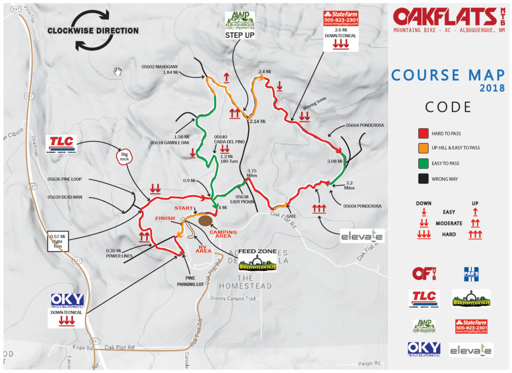

**Course Description**: Fast and flowing, easy to technical single track with many options to pass.  Terrain is sandy to compact, with some rocky sections. Multiple loops makes this a spectator friendly course. Please bring your family.

# REGISTRATION/START/FINISH/VENDORS

